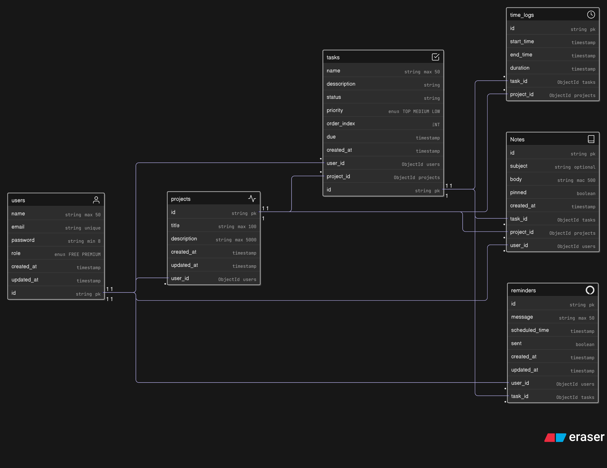

# 🚀 Jikanflow – Project Management Productivity System

> 🧠 Manage tasks, track time, take notes, and receive reminders — all in one place.

---

## ⚠️ Project Status: Under Development

Jikanflow is currently in active development.
Features, APIs, and internal logic are subject to change — things may break or behave unexpectedly as improvements are made.

We appreciate your interest and welcome feedback, but please note that the system is not yet stable for cloning or testing.

---

## ✨ Project Overview

**Jikanflow** is a modular productivity tool designed for freelancers and solo creators. It combines essential features like:

- ✅ Project-based to-do management (Kanban-style drag & drop)
- ⏱️ Time tracking per task
- 📝 Notes per task
- 🔔 Smart reminders via email
- 📦 Microservice architecture with Spring Boot and Express
- 🐇 RabbitMQ for async communication

---

## 📸 DB Design



<!-- Add screenshots or Loom video demo here -->
Coming soon...

---

## 🏗 Architecture

```plaintext
                                +---------------------+
                                |     Frontend UI     |
                                |  (React + DnD)     |
                                +----------+----------+
                                           |
                                           v
                   +-----------------------+-----------------------+
                   |                                               |
        +----------v----------+                         +----------v----------+
        |   core-service       |                         |   notify-service     |
        | Spring Boot + JPA    |                         | Express + Rabbit |
        | Handles:             |                         | Sends reminders,     |
        | - Auth (JWT)         |                         | listens to RabbitMQ  |
        | - Projects, Tasks    |                         +----------------------+
        | - Notes, Time Logs   |
        +----------+-----------+
                   |
         PostgreSQL (shared DB)

```

## Folder Structure

trackflow/
├── client/                  # React frontend
├── services/
│   ├── core-service/        # Auth, Projects, Tasks, Notes, TimeLogs
│   └── notify-service/      # CRON scheduler, email/push notifier
├── shared/                  # Shared DTOs, types
├── docker-compose.yml       # Orchestration
└── README.md

## Features and Modules

| Feature         | Tech / Library                               |
| --------------- | -------------------------------------------- |
| 🧾 Task Kanban  | [`@dnd-kit`](https://dndkit.com/) in Next.js |
| 🧩 Auth         | Spring Security + JWT                        |
| 📝 Notes        | Markdown input / Rich Text (Tiptap optional) |
| ⏱ Time Tracking | Task Timer + Backend Logs                    |
| 🔔 Reminders    | Scheduled with Spring `@Scheduled`, RabbitMQ |
| 💾 DB           | PostgreSQL                                   |
| 📨 Messaging    | RabbitMQ (`spring-boot-starter-amqp`)        |
| 🐳 DevOps       | Docker Compose, GitHub Actions (optional)    |

## ⚙️ Technologies Used

**Frontend**:

- React 18

- Tailwind CSS

- Zustand

- @dnd-kit – for drag-and-drop

**Backend**:

- Spring Boot 3+

- Spring Security + JWT

- Spring Data JPA

- RabbitMQ

- PostgreSQL

**DevOps**:

- Docker

- Docker Compose

## 🗃️ Database Schema (ERD)

Handled via PostgreSQL. Sample entities:

1. User: id, name, email, passwordHash, role

2. Project: id, user_id, name, description

3. Task: id, project_id, title, status, estimate

4. TimeLog: id, task_id, start_time, end_time, duration

5. Note: id, project_id, content, created_at, task_id

6. Reminder: id, user_id, message, scheduled_time, sent

## API Design

**Auth**:
POST /api/auth/signup
POST /api/auth/login
GET /api/user/profile

**Projects**:
GET /api/projects
POST /api/projects
GET /api/projects/{id}
PUT /api/projects/{id}
DELETE /api/projects/{id}

**Tasks**:
POST /api/projects/{id}/tasks
PATCH /api/tasks/{id}/status
POST /api/tasks/{id}/start-timer
POST /api/tasks/{id}/stop-timer

**Notes**:
GET /api/projects/{id}/notes
POST /api/projects/{id}/notes

**Reminders**:
POST /api/reminders
RabbitMQ → trigger email via notify-service

## 📈 Roadmap (Sprint-wise)

**✅ Sprint 1: Core Setup**:

- Docker Compose (Postgres, RabbitMQ, services)

- Spring Boot boilerplates

- React.js UI + auth setup

**✅ Sprint 2: Projects + Tasks**:

- Drag-and-drop Kanban board

- API integration

- Task status updates

**✅ Sprint 3: Time Tracking + Notes**:

- Timer logic + backend logs

- Notes module per task

**✅ Sprint 4: Reminders + Notification Service**:

- Reminder DB + message queue

- Spring CRON + Email sender

**✅ Sprint 5: Final Touches**:

- AI (optional)

- Dashboard UI polish

## 🛡 Security & Roles

**JWT Authentication**:

- Role-based access (user, admin)

- Client isolation
